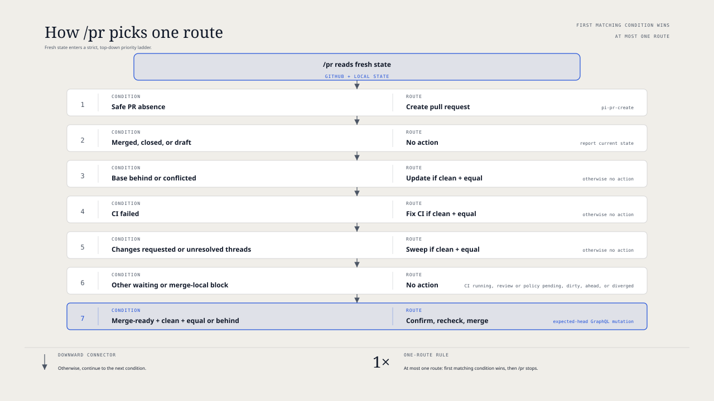

# `@henryqw/pi-pr`

See the current branch pull request in the Pi footer. Use `/pr` to run its next safe step. It shows CI, review, merge, and lifecycle status without repeated `gh` commands.

## Install

```bash
pi install npm:@henryqw/pi-pr
```

Requires an authenticated GitHub CLI session (`gh auth login`) and a checkout on GitHub.com or GitHub Enterprise. Run `gh auth status` to verify authentication.

## Feedback snapshots

`pr-feedback.mjs fetch --out FILE` prints a compact feedback index. The index
includes IDs, kinds, states, authors, locations, and parent IDs as needed. It
does not print comment or review bodies.

With `--out`, it atomically replaces `FILE` as a mode-0600 file. It does not
change the parent directory's permissions.

The saved snapshot still contains the complete feedback. `fetch --json` also
keeps the complete JSON output. Read one item with
`pr-feedback.mjs show --snapshot FILE --id ID`.

`show` prints one JSON record with its exact stored body and fields. A thread
record includes child IDs without child bodies. Treat that record as a container.
Inspect the `thread_comment` IDs directly. Do not call `show` on the parent only
to find children. Show the parent only when it has no child, or when you need
parent-level metadata. Issue independent `show` lookups in one tool-call round.
A nested comment includes only its parent thread's ID, state, and location.
Missing, unknown, duplicate, or ambiguous IDs fail. `show` does not run Git, call
GitHub, use the network, or write files.

## Works with

**Requires.** [`@henryqw/pi-herdr`](https://pi.henry.wang/extensions/pi-herdr) is the shared Herdr CLI client. It installs with this package.

**Improves.** [`@henryqw/pi-footer`](https://pi.henry.wang/extensions/pi-footer) shows current-branch pull-request status in the footer.

## Use

Run `/pr` in a GitHub checkout. It reads fresh pull request and local state, then runs one route. The PR hostname selects its GitHub API host, and the extension works outside Herdr.

For creation, put an optional base branch first. For example, run `/pr --base release/2026 Keep the title concise.` The base is a branch name, not a host or repository. Only creation accepts the base and remaining guidance. Other routes reject them instead of ignoring them.

| Surface | Type | Purpose |
| --- | --- | --- |
| `/pr [--base BRANCH] [creation instructions]` | command | Run the current pull request's next safe route. |
| Footer | ui | Show a linked `PR #number` and one plain-language status. |
| Widget | ui | Show one action hint or transient routing status. |

The footer already shows the pull request and status. Actionable widgets omit duplicate identity and status. Each uses one semantic status icon, a space, and a plain `Run /pr to …` route. `✗` marks errors, `!` warnings, `✓` success, and `●` accent or neutral routes. In TUI, only the icon uses a theme color. RPC and non-TUI output use the same plain text without ANSI.

The widget switches to `⠋ Checking pull request…` as soon as `/pr` starts discovery. The braille spinner animates in TUI mode. RPC receives one plain static line. The footer stays unchanged. The routing widget clears after route selection and before any prompt, notification, mutation, or workflow dispatch.

## Flow

Each footer entry is one linked `PR #number` plus one plain-language status: `N unresolved`, `draft`, `open`, `approved`, `CI running`, `CI failed`, `changes requested`, `base update required`, `merge conflict`, `merge-ready`, `merged`, or `closed`. Colors support the text; they do not carry meaning alone.



### Routes

| Current condition | `/pr` route |
| --- | --- |
| No current-branch pull request, no published matching ref, safe Git push configuration, and a commit ahead of the selected base | Start pull-request creation. |
| One open pull request inferred from a published matching ref | Confirm the exact `remote/ref`, then link the local branch. |
| Ambiguous or unsafe discovery | Show the blocked reason and do not mutate Git or GitHub. |
| Base update required or merge conflict | Update from the base branch's current target when the tree is clean and local HEAD equals the PR head. |
| GitHub Actions job failed | Run the CI fix workflow when the same local prerequisite holds. |
| External check or commit status failed | Show `CI failed` as a no-action blocker. |
| Changes requested or unresolved review threads | Run the package comment sweep when the same local prerequisite holds. |
| No-action state | Report the state without taking action. |
| Merge-ready pull request | Ask for final confirmation, recheck fresh state, and squash-merge if confirmed. |

`pi-pr-create` selects its base in this order: the leading `/pr --base BRANCH`, one `branch.<branch>.gh-merge-base` value, then the default branch of validated `origin`. It captures the selected base OID and merge-base. Creation requires at least one committed change ahead. Dirty work alone does not enable creation. If the current branch is the selected base, pi-pr stays silent because GitHub cannot create a pull request from a ref to itself.

The base always comes from validated `origin`. The head may use that repository or a fork with the same GitHub source. Base and head must use the same GitHub host. Other fork relationships stop before mutation.

It merges the captured base commit before validation and push. It resolves clear conflicts and stops when the base or conflict intent is ambiguous.

A configured target never changes branch upstream settings. Without a target, the helper pushes the captured OID to the local branch ref on validated `origin` and fetches its tracking ref. It leaves upstream unset. It creates or updates and validates the exact PR before it sets and verifies upstream. A failed setup rolls back only unchanged helper-owned settings. If configuration changed concurrently, it stops without overwriting it. Retrying `publish` resumes setup without another push or PR mutation.

Without a configured push target, discovery checks validated remotes for the same branch ref. One exact open PR becomes an inferred target. `/pr` names the exact `remote/ref` and asks before linking it. The extension revalidates the branch, PR, remote OID, and Git configuration before mutation. It rolls back its upstream and remote-tracking changes if final verification fails.

Multiple candidate remotes, multiple matching PRs, OID mismatches, and unsafe Git push configuration block routing. A published ref with no PR also blocks creation. If no candidate ref exists, creation uses only a validated `origin` destination.

The creation workflow repeats destination, remote OID, PR, and configuration checks immediately before pushing. It pushes to the saved validated URL, not a mutable remote name. Every push uses the saved remote OID as an exact lease. Existing refs must also be ancestors of the captured local OID. A missing ref uses an empty lease as a create-only compare-and-swap.

Each helper workflow receives a random run ID and its first action. The run stays bound to one session, canonical worktree, route, and fresh authority. Helper calls from another run, session, worktree, or route fail.

Only one helper run can exist at a time. Most runs expire when the agent settles. A create or branch-update conflict stays available for one user-guided continuation, then expires after that continuation settles. Session replacement and shutdown forget the run without aborting or cleaning a pending merge.

After a `/pr` create workflow settles, the extension waits for a refresh that finds a configured current PR. It then prefixes the Herdr workspace label with `#<number> • `.

Failed or empty discovery leaves one rename pending for a later refresh. A restored configured PR completes the rename even when GitHub reports it as merged or closed.

It removes repeated leading `#<number> • ` prefixes and legacy trailing ` · PR #<number>` suffixes before adding one current prefix. The remaining workspace name must be non-empty. This requires `HERDR_ENV=1` and a non-empty, trimmed `HERDR_WORKSPACE_ID`.

It renames only the workspace. Outside Herdr, it does nothing.

If Herdr lookup, JSON validation, or rename fails, the PR and normal UI refresh remain available. Each Herdr command has a 10-second timeout. The extension warns with `Herdr workspace rename failed: <error>`.

Current-branch discovery reads pull requests associated with the exact push repository ref. It does not run a global branch search. It finds a fork-head PR whose base is an upstream repository. A unique historical match uses the exact remote push-ref OID, not local HEAD.

A no-action state includes drafts, merged or closed pull requests, running or unsupported failed CI, pending review, and blocked merge policy. A dirty tree or mismatched local HEAD also blocks a mutating workflow.

### Route priority

A missing pull request uses creation. For an existing pull request, the first matching condition wins:

1. Merged, closed, or draft: no action.
2. Base update required or merge conflict. Run only with a clean tree and equal local and PR heads.
3. A failed GitHub Actions job. Apply the same local prerequisite. Other failed checks remain blockers.
4. Changes requested or unresolved review threads. Apply the same local prerequisite.
5. Waiting or local safety block: no action.
6. Merge-ready: allow clean local HEAD equal to or behind the PR head. Confirm, then merge directly.

Ordinary conversation comments do not trigger a route or block a merge. Changes requested and unresolved review threads can select the package comment sweep.

The comment sweep resolves its bundled helper and references from the installed package skill path. It does not require an external `jq` executable.

After publishing, `refresh` freezes the complete latest feedback and returns only IDs and kinds. Use `show` to inspect every fresh item.

A second guarded `record` must cover that exact snapshot before resolution or finalization. It keeps the paths from the initial record.

The sweep runs existing non-destructive checks on the clean committed `HEAD` before publishing. Finalization reruns them as a later state guard.

### Refresh

The footer and widget load at session start. A directory outside a Git worktree stays silent and does not start polling. The UI shows `PR · status unavailable` for other discovery failures and reports only a generic error.

They refresh after local commits, PR creation, pushes, and each dispatched workflow settles. During creation, intermediate refreshes wait until the workflow settles. They also refresh after any successful delegated task settles. Active Git worktrees poll every 30 seconds. Polling updates presentation only and may be stale.

The create widget stays hidden until the local branch has a commit beyond its creation point. `/pr` replaces any hint with routing feedback while it selects a route. The feedback clears before route interaction. A dispatched workflow keeps the widget hidden until the agent settles. Direct and no-action routes refresh it after completion. A failed command restores the prior hint and schedules a refresh.

Presentation uses route priority, so draft appears before running CI. `/pr` reads fresh state before routing or merging. The command is authoritative for actions.

### Session identity

The extension records one configured PR identity in the Pi session. It stores only the PR URL, number, host, head identity, and configured target identity. It does not store lifecycle, CI, review, readiness, or base state. Repeated polling does not add duplicate entries, and no repository cache file is created.

Normal discovery always runs first. If the configured remote ref was deleted, the footer and `/pr` may reload the exact observed PR URL. The current host, repository, branch, remote, ref, and local HEAD must still match the observation. Repository names use case-insensitive GitHub matching.

The GitHub response must match the observed URL, host, repository, head ref, head OID, and PR number. GitHub supplies fresh mutable state. Invalid session data is ignored. A failed GitHub lookup stops routing and cannot start PR creation.

## Limits and recovery

- `/pr` accepts creation syntax only as a leading `--base BRANCH`, followed by optional creation guidance. It does not open a browser.
- It does not run `/done` or `/sweep`.
- Polling does not auto-triage comments or start a workflow. The package comment sweep runs only when an explicit `/pr` selects it.
- It does not enable auto-merge or add a merge queue.
- It does not rebase the local branch, overwrite concurrent remote updates, delete branches, or clean up worktrees. Creation uses exact leases plus ancestry checks; an empty lease is only an atomic absence check.
- Creation, discovery, and comment-sweep pushes require one unambiguous push URL for the configured destination.
- Presentation fetches use that exact push URL and exact advertised OID. They do not use shared fetch state.
- A pull request that GitHub reports as behind requires a base update.
- Direct merges always use squash. GitHub rejects the mutation if repository policy does not allow it.
- Before merge, `/pr` fetches the exact head OID from the validated push URL without shared fetch state.
- A merge, rebase, cherry-pick, revert, or sequencer state blocks direct merge, even when `git status` is empty.
- A branch update resolves the base repository ref directly. It stops if that ref moves before merge or push.
- Before a comment-sweep push, it revalidates the configured destination, full PR identity, and local HEAD. It pushes the captured OID.
- CI repair streams a bounded failed-step log tail and runs one narrow local reproducer before editing.
- Before push, CI repair revalidates the saved destination, open PR, failure evidence, and repair HEAD.
- An already-published local HEAD needs no second push.
- Direct merge requires final confirmation and a fresh readiness check.
- After a successful merge, the create widget stays hidden until a new local commit.
- Only authenticated GitHub.com and GitHub Enterprise repositories are supported.
